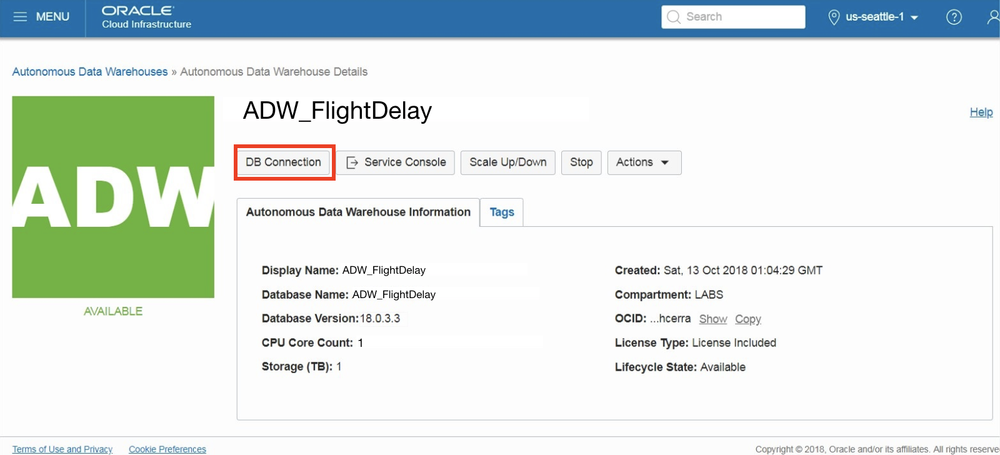
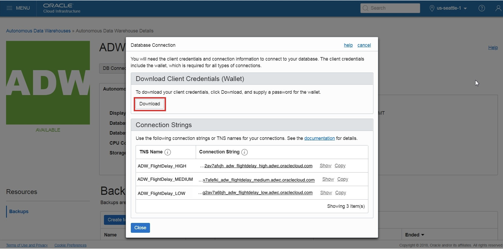
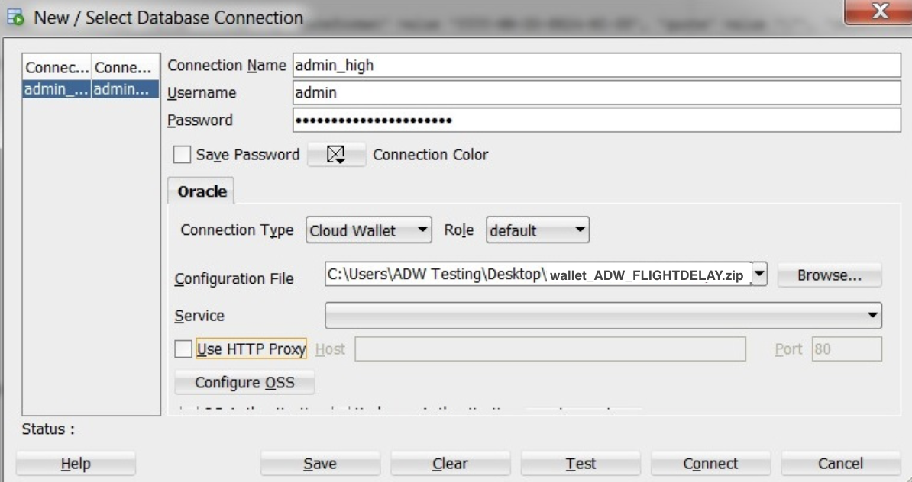
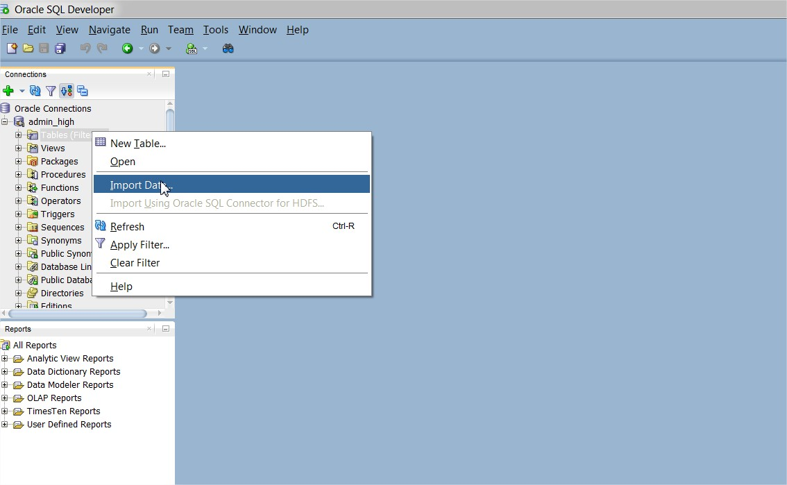
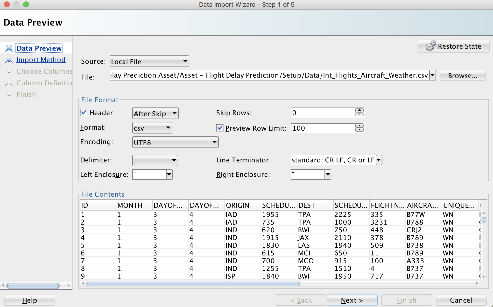
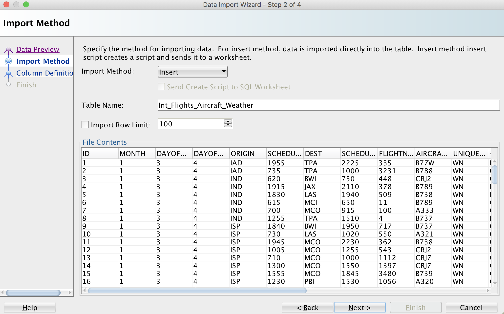
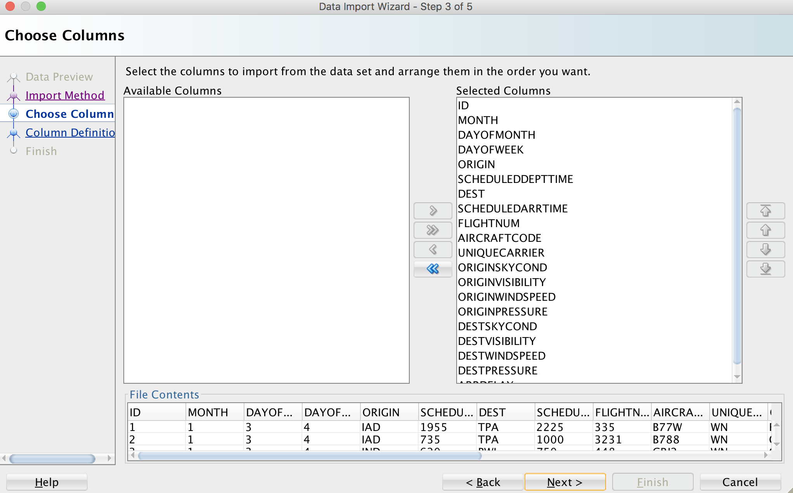
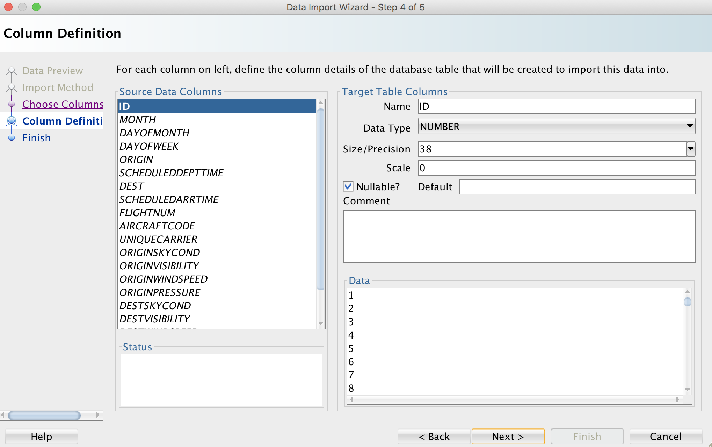

# Loading Datasets to Autonomous Data Warehouse (ADW) using SQL Developer

  
Updated: January 4, 2019

## Introduction

This lab walks you through the steps to load datasets from local file system into the Autonomous Data Warehouse (ADW) instance that you provisioned in the previous lab. You will use SQL Developer for connecting and uploading datasets to ADW. 

**_To log issues_**, click here to go to the [github oracle](https://github.com/oracle/learning-library/issues/new) repository issue submission form.

## Objectives
-   Learn how to connect to your new Autonomous Data Warehouse using SQL Developer
-   Learn how to use the SQL Developer Data Import Wizard to load datasets
-   Learn how to prepare datasets for training, validating and applying the machine learning models

## Required Artifacts
-   The following lab requires an Oracle Public Cloud account. You may use your own cloud account, a cloud account that you obtained through a trial, or a training account whose details were given to you by an Oracle instructor.

-   Oracle SQL Developer 18.3 or later (see <a href="http://www.oracle.com/technetwork/developer-tools/sql-developer/downloads/index.html" target="\_blank">Oracle Technology Network download site</a>)
Please use SQL Developer version 18.3 or later as this version contains enhancements for key Autonomous Data Warehouse features, including using ADW behind a VPN or Firewall.

# Connect to ADW and Load Datasets to the ADW instance using SQL Developer

## Part 1. Connect SQL Developer to the ADW instance
In this section you will connect the SQL Developer to the ADW instance that you provisioned in Lab 100.

### **STEP 1: Download the Connection Wallet**
As ADW only accepts secure connections to the database, you need to download a wallet file containing your credentials first. The wallet can be downloaded either from the instance's details page, or from the ADW service console. In this case, we will be showing you how to download the wallet file from the instance's details page.

-   In your databases's instance details page, click **DB Connection**.

-   Under Download a Connection Wallet, click **Download**.

-   Specify a password of your choice for the wallet. You will need this password when connecting to the database via SQL Developer later, and is also used as the JKS keystore password for JDBC applications that use JKS for security. Click **Download** to download the wallet file to your client machine. 
*Note: If you are prevented from downloading your Connection Wallet, it may be due to your browser's pop-blocker. Please disable it or create an exception for Oracle Cloud domains.*

### **STEP 2: Connect to the database using SQL Developer**
Start SQL Developer and create a connection for your database using the default administrator account 'ADMIN' by following these steps.

-   Click the **New Connection** icon in the Connections toolbox on the top left of the SQL Developer homepage.

-   Fill in the connection details as below:

-   **Connection Name:** admin_high

-   **Username:** admin

-   **Password:** The password you specified during provisioning your instance

-   **Connection Type:** Cloud Wallet

-   **Configuration File:** Enter the full path for the wallet file you downloaded before, or click the **Browse button** to point to the location of the file.

-   **Service:** There are 3 pre-configured database services for each database. Pick **&lt;databasename&gt;_high** for this lab. For
example, if you the database you created was named adwfinance, select adwfinance_high as the service.

*Note* : SQL Developer versions prior to 18.3 ask for a **Keystore Password.** Here, you would enter the password you specified when downloading the wallet from ADW.

-   Test your connection by clicking the **Test** button, if it succeeds save your connection information by clicking **Save**, then connect to your database by clicking the **Connect** button. An entry for the new connection appears under Connections.

-   If you are behind a VPN or Firewall and this Test fails, make sure you have <a href="https://www.oracle.com/technetwork/developer-tools/sql-developer/downloads/index.html" target="\_blank">SQL Developer 18.3</a> or higher. This version and above will allow you to select the "Use HTTP Proxy Host" option for a Cloud Wallet type connection. While creating your new ADW connection here, provide your proxy's Host and Port. If you are unsure where to find this, you may look at your computer's connection settings or contact your Network Administrator.

## Part 2. Load Data File to the ADW Instance

### STEP 3: Download the Data File to Your Local Computer

For this lab you will need a data file. To download the file, click [Int_Flights_Aircraft_Weather.csv](.files/datasets/Int_Flights_Aircraft_Weather.csv) data file. This data file is the resulting integrated table including flight, weather, and aircraft data at each time and each airport. If you want to follow steps to make this data file integrating flight.csv, weather.csv and aircraft.csv files, //// go to optional lab 600 . 

### **STEP 4: Load the data file to the ADW Instance using SQL Developer Data Import Wizard**

// sql developer data import wizard 
- Click **Tables** in your user schema object tree. Clicking the right mouse button opens the context-sensitive menu in SQL Developer; select **Import Data**. 

- The Data Import Wizard is started. Enter the following information:

  - Select Local File as source for the data load

  - Click the browse button and navigate to the Int_Flights_Aircraft_Weather.csv file 
  
After selecting the file, you can preview the data and select the appropriate file formats. You will see that the data preview is interactive and changes according to your selection.

When you are satisfied with the file content view, click **NEXT**.

 
  

On Step 2 of the Import Wizard, you control the import method and parameters. Leave the Import Method as Insert. Enter **Int_Flights_Aircraft_Weather** as your target table name, this table will be created by the import wizard. Click **NEXT**.

The Choose Columns screen lets you select the columns you want to import. Leave the defaults and click NEXT.

The column definition screen allows you to set the column names and data types for your new table. You can change these if you need to. For this exercise leave them as default and click **NEXT**.

Click **FINISH** to load the data into your newly created table **Int_Flights_Aircraft_Weather**. 

-   Use the SQLDeveloper to import the [station_info.csv](./files/datasets/station_info.csv) dataset to a table (Station_Info) in the database.

-   Use the SQLDeveloper to import the [station_status_weather.csv](./files/datasets/station_status_weather.csv) dataset to a table (Station_Status_Weather) in the database. Make sure the LAST_REPORTED column is created as a DATE type column. (Note that this table has ~1M rows, so it may take about 30mins to import the table using the SQL Developer wizard.)

### **STEP 4: Grant Privileges to the OML User to Access Datasets** // create new user and grant it to .... 
In order to avoid running into an access error when you run the code in OML, grant all privleges to the OML user for the tables you created in the database.

-   Under your connection in the SQL Developer, right-click on **Station_Info** table, select **Privileges** and then select **Grant**.

-   In the popped screen, select your OML user in the **Uers/Roles** field, mark **Grant ALL** option and click on **Apply**.

-   You should see a message indicating that your action was successful. Repeat the same steps to also grant privileges on the table **Station_Status_Weather**.

### **STEP 5: Prepare the Data for Training ML Models in OAC**
-   Copy and paste the code snipper in [data_prep.sql](./files/scripts/data_prep.sql) file to your SQL Developer worksheet and run the script. This code prepares the portion of data that you will need for training an ML model in OAC .

## Great Work - All Done with Lab200!
**You are ready to move on to the next lab. You may now close this tab.**

