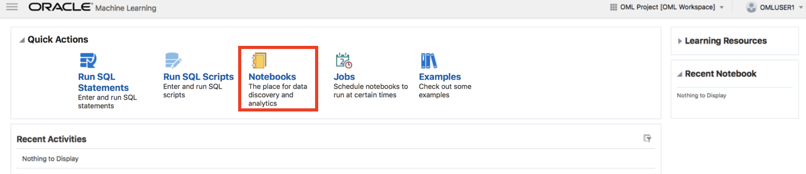

  
Updated: January 4, 2019

## Introduction

This lab walks you through the steps to build a linear regression model in Oracle Machine Learning (OML) Notebook since we learned that linear regression algorithm is one of the best models on previous lab. 

**_To log issues_**, click here to go to the [github oracle](https://github.com/oracle/learning-library/issues/new) repository issue submission form.

## Objectives
-   Learn how to build and apply machine learning model in Oracle Machine Learning (OML)

## Required Artifacts
-   The following lab requires an Oracle Public Cloud account. You may use your own cloud account, a cloud account that you obtained through a trial, or a training account whose details were given to you by an Oracle instructor.

# Building a Machine Learning Model in Oracle Machine Learning (OML) Notebook

## Part 1. Import Notebook File to OML 

### **STEP 1: Sign into OML**

-   Go back to the Cloud Console and Click the **Service Console** button on your Autonomous Data Warehouse details page.

-   Click the **Administration** tab and click **Manage Oracle ML Users** to go to the OML user management page. This will open OML user Administration page as a new tab within your browser.

- Click the **Home icon** on the top right of Oracle Machine Learning User administration page to go to OML home page.

- Sign in using your new user account **omluser1**. 

### **STEP 2: Import Notebook File (Flight Delay Predictino.json) to OML **

- Once you have successfully signed in to OML the application home page will be displayed. Let's click **Notebooks**. 

- To download the .json notebook file, click [here](./files/scripts/Flight Delay Prediction.json). In the **Notebooks** section, click on **Import** to import the downloaded file. 

## Part 2. Run the imported OML Notebook

### **STEP 3: Run Each Paragraph in the OML Notebook**

- Let's open the imported OML Notebook (**Flight Delay Prediction.json**). Then, select **%md** and one of the **%sql and %script** interpreters. 

- Now, run each paragraph in the OML Notebook (**Flight Delay Prediction.json**). 

- each paragrapph 

Next, you should choose the class of machine learning algorithms applicable to this problem. In this case, you need a numerical prediction algorithm, so choose the corresponding class of algorithms.

-   Among the available built-in algorithms, select the **Linear Regression** model.

-   As you can see, all the variables except one are set by default. The only variable you need to specify in order to have a complete linear regression model is the target column. You can select the target column from the list of existing columns in the table. Since you want to predict the number of available bikes at each station, you should select the “AVIALABLEBIKES”.

-   Now, save both the model and the Data Flow.

-   Once the Data Flow is saved, you can click on **Run Data Flow**, which trains the model on the data you selected in the first step.

## Part 2. Compare Different Machine Learning Models

**Note:** In this section, you will compare different machine learning models to find the one which fits this problem the best. One way to do this is to repeate **Part 1** three more times and create other built-in machine learning models one by one. However, to simplify the process, we have already created all those models and the comparison between them in a DVA project. Next steps will shoe you how you can import that project and use it as a base for creating more graphs in the next labs.

### **STEP 2: Import the .DVA Project**

-   Click on the hamburger icon on the top right side of the OAC home page and select **Import Project**.

-   Click on **Select File** and upload the [**BikeSharePrediction.dva**](./files/project/BikeSharePrediction.dva) file. Then click on **Import** to import the project to your OAC instance.

-   When the import is successful, a message will pop up. Click on **OK**.

-   You can see the project under the section **Projects**.

## Great Work - All Done with Lab400!
**You are ready to move on to the next lab. You may now close this tab.**
